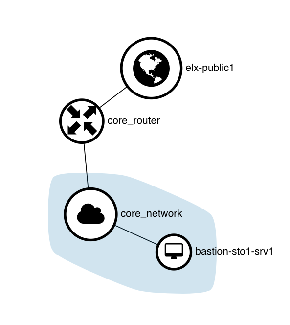

# Router and networking

In this example we create a router and network with a subnet



> In ELASTX OpenStack, only one router per tenant/project may be used.

## Relevant files

```less
├── example.auto.tfvars
├── main.tf
├── output.tf
└── variables.tf
```

## How to run

```shell
$ terraform init

Initializing the backend...

Initializing provider plugins...

Terraform has been successfully initialized!
[...]
```

```shell
$ terraform apply

An execution plan has been generated and is shown below.
Resource actions are indicated with the following symbols:
  + create

Terraform will perform the following actions:  

[...]

Plan: 4 to add, 0 to change, 0 to destroy.

Do you want to perform these actions?
  Terraform will perform the actions described above.
  Only 'yes' will be accepted to approve.

  Enter a value: yes

[...]

Apply complete! Resources: 4 added, 0 changed, 0 destroyed.
Releasing state lock. This may take a few moments...

Outputs:

bastion_secgroup_id = 178c7749-d4d9-47d5-8127-ab306d513e92
bastion_secgroup_name = bastion
bastion_servers_ansible = <<EOT
[bastion_servers]
bastion-sto1-srv1 ansible_ssh_host=X.X.X.X
EOT
bastion_servers_map = {
  "bastion-sto1-srv1" = "X.X.X.X"
}
network_id = "95efc080-749b-4ea7-a12b-fb7131f75768"
network_name = "core_network"
subnet_id = "9eaf5e72-e33f-4e06-b892-f76842b586a0"
subnet_name = "core_subnet"
```

```shell
$ terraform state list
openstack_networking_network_v2.network
openstack_networking_router_interface_v2.router_interface
openstack_networking_router_v2.router
openstack_networking_subnet_v2.subnet
```
