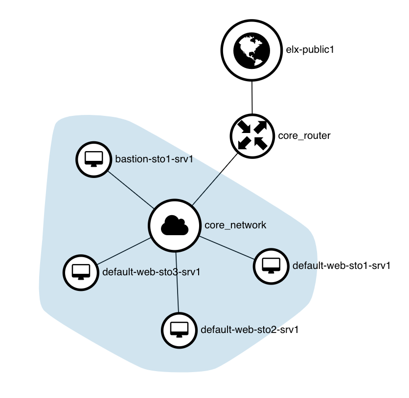

# Web Servers and Load Balancing



## Relevant files

```less
├── example.auto.tfvars
├── main.tf
├── output.tf
└── variables.tf
```

## How to run

```shell
$ terraform init

Initializing the backend...

Initializing provider plugins...

Terraform has been successfully initialized!
[...]
```

```shell
$ terraform apply
data.terraform_remote_state.core: Refreshing state...

An execution plan has been generated and is shown below.
Resource actions are indicated with the following symbols:
  + create

Terraform will perform the following actions:

[...]

Plan: 19 to add, 0 to change, 0 to destroy.

Do you want to perform these actions?
  Terraform will perform the actions described above.
  Only 'yes' will be accepted to approve.

  Enter a value: yes

  [...]

Apply complete! Resources: 19 added, 0 changed, 0 destroyed.
Releasing state lock. This may take a few moments...

Outputs:

loadbalancer_ip = X.X.X.X
web_servers_ansible = [web_servers]
web-sto1-srv1 ansible_ssh_host=10.0.65.21
web-sto2-srv1 ansible_ssh_host=10.0.65.7
web-sto3-srv1 ansible_ssh_host=10.0.65.2
```
