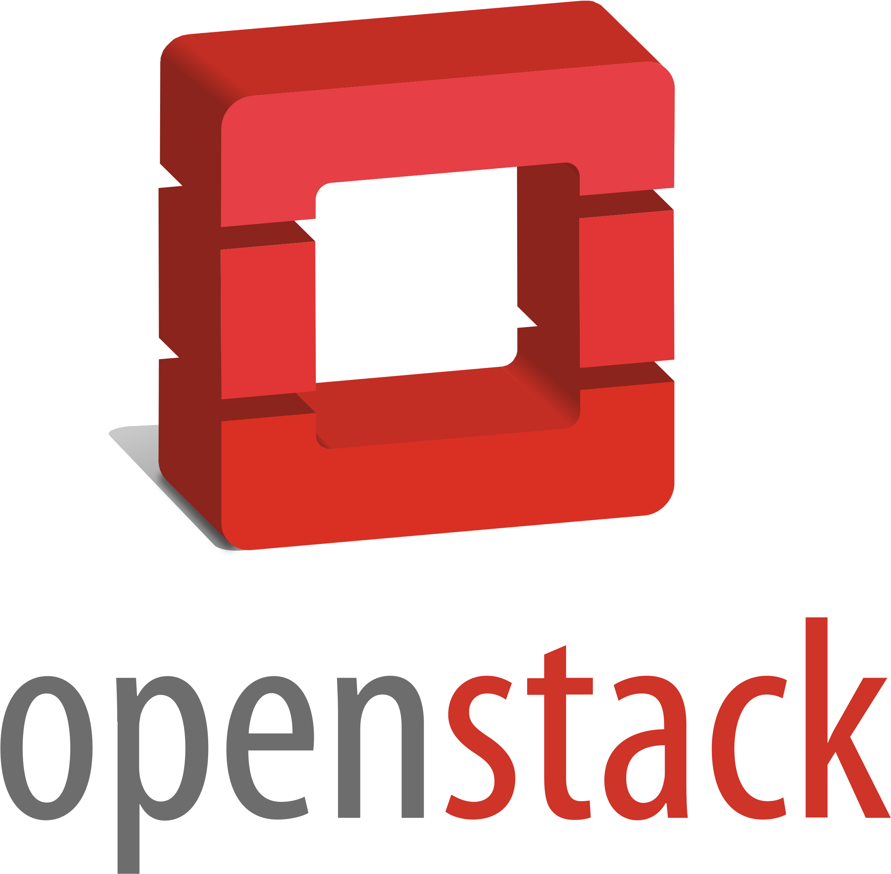

<!-- PROJECT LOGO -->
 

  

  <h3 align="center">Getting started with Terraform on ELASTX OpenStack</h3>

  

    Infrastructure as Code
     
     
       <a href="https://github.com/elastx/getting-started-elx-openstack/issues">Report Bug</a>
    ·
    <a href="https://github.com/elastx/getting-started-elx-openstack/issues">Request Feature</a>
  

<!-- TABLE OF CONTENTS -->

  
<h2 style="display: inline-block">Table of Contents</h2>

  <ol>
    <li>
      <a href="#about-the-project">About The Project</a>
    </li>
    <li>
      <a href="#getting-started">Getting Started</a>
      <ul>
        <li><a href="#prerequisites">Prerequisites</a></li>
      </ul>
    </li>
    <li><a href="#roadmap">Roadmap</a></li>
    <li><a href="#contributing">Contributing</a></li>
    <li><a href="#license">License</a></li>
    <li><a href="#contact">Contact</a></li>
    <li><a href="#acknowledgements">Acknowledgements</a></li>
  </ol>

<!-- ABOUT THE PROJECT -->
## About The Project

This is a walkthrough from a clean tenant. We think you can use this as a boiler plate for several use-cases. What you will get:

* A network stack
* Bastion host where you can manage your infrastructure
* Web servers spread out over three availability zones with a Load Balancer
* Using terraform remote state to reference resources from earlier step

<!-- GETTING STARTED -->
## Getting Started

Clone this repository and follow the steps and instructions in the ordered folders

* [00_Start_here](./00_Start_here/README.md) To generate Keypair
* [01_Router_Networking_Bastion](./01_Router_Networking_Bastion/README.md) To create a router, a network with a subnet and a bastion host
* [02_Web_Servers_LBaaS](./02_Web_Servers_LBaaS/README.md) To setup web-servers and a loadbalancer
* [03_Tear_down](./03_Tear_down/README.md) To clean up the tenant in Openstack

### Prerequisites

* Terraform
* Empty tenant in openstack

<!-- ROADMAP -->
## Roadmap

See the [open issues](https://github.com/github_username/repo_name/issues) for a list of proposed features (and known issues).

<!-- CONTRIBUTING -->
## Contributing

Contributions are what make the open source community such an amazing place to be learn, inspire, and create. Any contributions you make are **greatly appreciated**.

1. Fork the Project
2. Create your Feature Branch (`git checkout -b feature/AmazingFeature`)
3. Commit your Changes (`git commit -m 'Add some AmazingFeature'`)
4. Push to the Branch (`git push origin feature/AmazingFeature`)
5. Open a Pull Request

> We accept PRs for expanding and improve upon these examples

<!-- LICENSE -->
## License

Distributed under the MIT License. See `LICENSE` for more information.

<!-- CONTACT -->
## Contact

Team CS - [Elastx Support](http://support.elastx.se) - support@elastx.se
